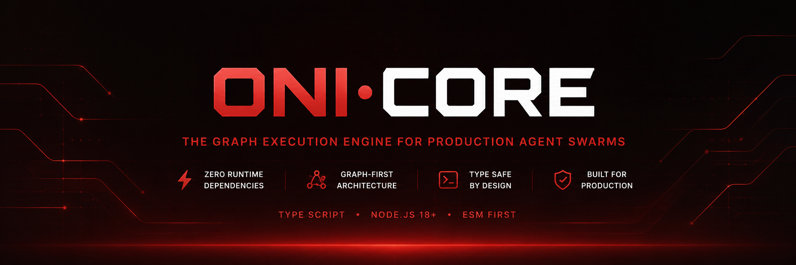

<p align="center">
  
</p>

ONI Core is a TypeScript graph execution engine for production agent swarms,
stateful workflows, tool execution, streaming, persistence, human review, and
background-agent orchestration.

The root package stays dependency-light and ESM-first. Optional peer packages
unlock runtime integrations such as SQLite, Postgres, Redis, model adapters,
document loaders, and dev tooling without forcing them into every install.

## Install

```bash
npm install @oni.bot/core
```

Requirements:

- Node.js 18+
- TypeScript projects should use ESM-compatible module resolution.
- Optional peers are installed only when you use the matching backend or package.

## What Is Included

- Graph runtime: `StateGraph`, `MessageGraph`, channels, reducers, conditional
  routing, retries, checkpointing, and streaming.
- Swarm runtime: agent registries, pools, handoffs, supervisors, tracing,
  snapshots, scaling monitors, and topology helpers.
- Tool runtime: structured tool definitions, runtime policy wrapping, execution,
  permissions, audit logs, and guardrails.
- Model adapters: raw HTTP adapters for Anthropic, OpenAI, OpenRouter, Google,
  and Ollama.
- Platform control plane: background sessions, triggers, queues, identities,
  capability grants, environments, artifacts, review gates, health, and audit
  summaries.
- Harness layer: native agent loops, external CLI drivers, JSONL parsers,
  resumable metadata, safety gates, hooks, and context compaction.
- Release hardening: export smoke tests, type smoke tests, package tarball
  snapshots, dependency audit, secret scanning, coverage gates, and lint budgets.

## Quick Start

```ts
import { END, START, StateGraph, lastValue, appendList } from "@oni.bot/core";

type WorkflowState = {
  request: string;
  steps: string[];
  summary: string;
};

const graph = new StateGraph<WorkflowState>({
  channels: {
    request: lastValue<string>(() => ""),
    steps: appendList<string>(),
    summary: lastValue<string>(() => ""),
  },
});

graph.addNode("plan", async (state) => ({
  steps: [
    `Clarify scope: ${state.request}`,
    "Execute the smallest useful change",
    "Verify the result",
  ],
}));

graph.addNode("summarize", async (state) => ({
  summary: `Prepared ${state.steps.length} execution steps.`,
}));

graph.addEdge(START, "plan");
graph.addEdge("plan", "summarize");
graph.addEdge("summarize", END);

const app = graph.compile();
const result = await app.invoke({
  request: "Ship a monitored support workflow",
});

console.log(result.summary);
```

For token or event streaming, use `app.stream(input, { streamMode: "values" })`
or the dedicated streaming helpers exported from `@oni.bot/core/streaming`.

## Public Entry Points

The package publishes 23 import surfaces so consumers can import only the
runtime area they need.

| Import | Use it for |
|---|---|
| `@oni.bot/core` | Root graph runtime, channels, messages, swarm primitives, models, tools, platform, harness, telemetry, logging, and errors |
| `@oni.bot/core/prebuilt` | ReAct agents, tool nodes, and prebuilt graph helpers |
| `@oni.bot/core/swarm` | Swarm graph templates, pools, handoffs, supervisors, snapshots, scaling, tracing, and topology helpers |
| `@oni.bot/core/hitl` | Human-in-the-loop interrupts, approvals, selections, and session storage |
| `@oni.bot/core/store` | In-memory and namespaced cross-thread stores |
| `@oni.bot/core/messages` | Message channels, reducers, message constructors, trimming, updates, and removals |
| `@oni.bot/core/checkpointers` | Memory, SQLite, Postgres, Redis, and namespaced checkpoint backends |
| `@oni.bot/core/functional` | Functional `task`, `entrypoint`, `pipe`, and `branch` APIs |
| `@oni.bot/core/inspect` | Graph descriptors, cycle checks, topological order, and Mermaid output |
| `@oni.bot/core/streaming` | Token streaming, stream writers, bounded buffers, and stream events |
| `@oni.bot/core/models` | Anthropic, OpenAI, OpenRouter, Google, and Ollama model adapters |
| `@oni.bot/core/tools` | `defineTool`, tool execution, schemas, permissions, and tool contexts |
| `@oni.bot/core/agents` | Functional agent definitions and swarm message context helpers |
| `@oni.bot/core/coordination` | Request/reply broker and pub/sub coordination primitives |
| `@oni.bot/core/events` | Lifecycle event bus and event listener contracts |
| `@oni.bot/core/guardrails` | Budgets, content filters, permission checks, and audit logging |
| `@oni.bot/core/testing` | Mock models, graph assertions, harness helpers, and test utilities |
| `@oni.bot/core/harness` | Agent loop, external agent host, CLI drivers, runtime registry, hooks, safety gates, context compaction, and JSONL parsers |
| `@oni.bot/core/mcp` | MCP stdio transport and JSON-RPC tool bridge |
| `@oni.bot/core/lsp` | Language Server Protocol client primitives |
| `@oni.bot/core/config` | JSONC config loading and environment variable resolution |
| `@oni.bot/core/registry` | Dynamic runtime tool registry |
| `@oni.bot/core/platform` | Background-agent sessions, routing, triggers, environments, stores, artifacts, review gates, runtime policy, health, and audit summaries |

## Platform Layer

`@oni.bot/core/platform` is the control plane for long-running or externally
executed work. It normalizes task submission, trigger handling, routing,
environment provisioning, scoped identity, capability grants, runtime policy,
artifact publication, review, and session health into one lifecycle.

The platform includes:

- Local, HTTP, and Cerebro execution environment providers.
- In-memory, JSON-file, SQLite, and Postgres session/artifact stores.
- CLI, scheduled, chat command, GitHub webhook, and dependency alert triggers.
- Runtime policy helpers for path, command, network, tool, and explicit secret
  grants.
- Session runners for native `agentLoop()`, external CLI providers, and compiled
  swarm workflows.
- `GitHubArtifactStore` for publishing pull requests, reports, diagnostics, and
  test summaries to GitHub while mirroring enriched records to another store.
- Health and audit summaries for queue depth, session status, failure rates,
  durations, costs, artifacts, and lifecycle events.

For a local smoke run:

```bash
oni platform-smoke --dir .oni/platform-smoke
```

## Workspace Packages

The monorepo also contains focused packages that build on the root runtime.

| Package | Status | Purpose |
|---|---|---|
| `@oni.bot/tools` | Public | Prebuilt tool definitions for filesystem, HTTP, search, Slack, Stripe, E2B, and related integrations |
| `@oni.bot/stores` | Public | Redis and Postgres store backends |
| `@oni.bot/loaders` | Public | Markdown, JSON, CSV, PDF, HTML, and DOCX document loaders |
| `@oni.bot/a2a` | Public | A2A protocol client, server, and swarm integration |
| `@oni.bot/integrations` | Public | ActivePieces-to-ONI adapter for community integrations |
| `@oni.bot/devtools` | Public | Lightweight dev server for graph topology, registry state, and live execution events |
| `@oni.bot/hot-loader` | Public | File-watching extension loader for `DynamicToolRegistry` |
| `@oni.bot/community` | Private | ActivePieces community source library used by the integrations package |

## Verification

Common local checks:

```bash
pnpm run typecheck
pnpm test
pnpm run build
pnpm run smoke:exports
pnpm run typecheck:exports
pnpm run pack:snapshot
```

Release verification runs the broader gate:

```bash
pnpm run verify:release
```

That gate combines root and package tests, strict type checking, coverage
thresholds, build checks, subpath export smoke tests, consumer type smoke tests,
dependency audit, content secret scanning, lint-warning budgets, and package
tarball snapshots.

## Documentation

- [Developer Guide](./GUIDE.md) - graph basics, channels, streaming,
  checkpointing, agents, swarms, and advanced runtime patterns.
- [Changelog](./CHANGELOG.md) - release history and compatibility notes.
- [Security](./SECURITY.md) - reporting and security policy.

## License

MIT - [AP3X Dev](https://github.com/AP3X-Dev)
